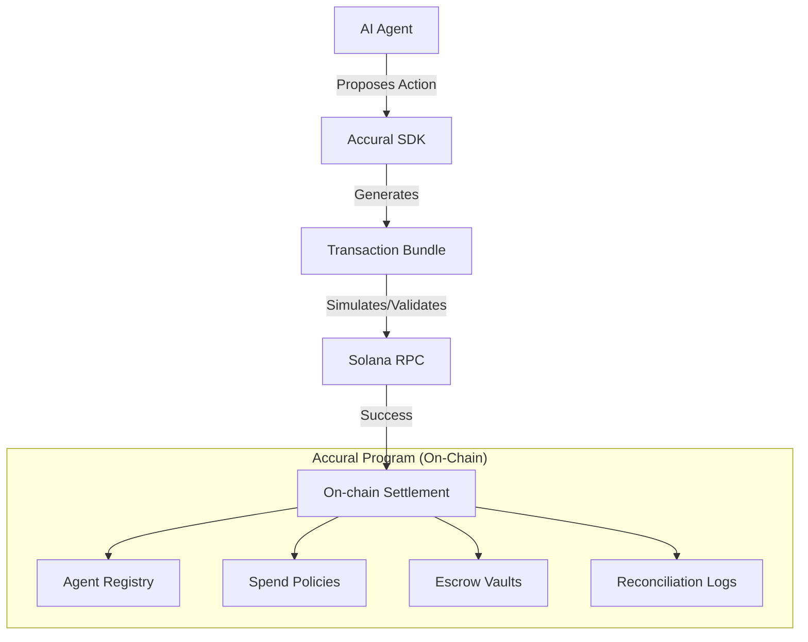

# Accural

**The Agent-Native Settlement and Coordination Layer on Solana.**

[](https://opensource.org/licenses/MIT)
[]()
[](https://solana.com/)

Accural is a decentralized coordination layer designed specifically for AI agents. It provides a secure, auditable, and policy-driven framework for agents to manage funds, execute payments, and handle escrows with built-in reconciliation.

---

## Overview

In the era of autonomous agents, moving money requires more than just a wallet. Accural acts as the connective tissue between agent logic and on-chain settlement, ensuring that every financial action is backed by:

- **Task Context**: Rationale for fund movement.
- **Spend Policies**: Guardrails on spending limits, allowed actions, and approval thresholds.
- **Escrow Protection**: Secure fund handling with verification-based release.
- **Auditable Reconciliation**: On-chain proof of semantic payment intent.

Accural is not a bank or a custodial service. It is a set of Anchor programs and a TypeScript SDK that empowers developers to build financially-aware agent systems.

---

## Key Features

- **Agent Registry**: On-chain identity and reputation tracking for autonomous agents.
- **Spend Policies**: Configurable guardrails managed via Program Derived Addresses (PDAs).
- **Payment Intents**: Verifiable requests for payment that link agent goals to financial transactions.
- **Task-Based Escrow**: Secure SPL-token escrow tied to specific payment intents with verifier-controlled release.
- **On-chain Reconciliation**: Cryptographic hash records of payment memory for immutable auditing.
- **Instruction Planning**: A sophisticated "Plan-then-Execute" workflow that allows agents to propose transaction bundles before they are signed.
- **Orchestration**: Support for both deterministic and LLM-driven agent execution.

---

## Architecture

Accural follows a modular architecture where the Anchor Program handles state and enforcement, while the TypeScript Client handles planning and execution.



---

## Getting Started

### Prerequisites

- Node.js (v16+)
- Rust and Cargo
- Solana CLI
- Anchor Framework

### Installation

1. **Clone the repository:**
   ```bash
   git clone https://github.com/dwan-ith/Accural.git
   cd Accural
   ```

2. **Install Client Dependencies:**
   ```bash
   cd client
   npm install
   ```

3. **Verify Program Build:**
   ```bash
   cargo check
   ```

### Verification

Run the comprehensive verification suite to ensure correct configuration:

```powershell
powershell -ExecutionPolicy Bypass -File .\scripts\verify-mvp.ps1
```

This script validates the Rust program compilation, TypeScript type-checking, local protocol logic, and backend service integration.

---

## Configuration

Accural is configured via environment variables.

| Variable | Description | Default |
| :--- | :--- | :--- |
| ACCURAL_SETTLEMENT_MODE | solana (on-chain) or local (SQLite) | solana |
| ACCURAL_RPC_URL | Solana RPC endpoint URL | http://localhost:8899 |
| ACCURAL_BACKEND_HOST | Host for the backend server | 127.0.0.1 |
| ACCURAL_BACKEND_PORT | Port for the backend server | 8787 |
| ACCURAL_OWNER_KEYPAIR | Path to the owner's Solana keypair file | - |
| ACCURAL_VERIFIER_KEYPAIR | Path to the verifier's Solana keypair file | - |
| OPENAI_API_KEY | Required for LLM-driven agent orchestration | - |

---

## API Reference

The Accural backend provides a RESTful interface and a Local Operator Console at `http://127.0.0.1:8787/`.

### Core Routes

| Method | Endpoint | Description |
| :--- | :--- | :--- |
| GET | /health | Check service status and settlement mode. |
| GET | /settlement/status | Reports Solana RPC and program readiness. |
| POST | /agent-runs | Execute an agent workflow (returns a transaction bundle). |
| POST | /solana/bundles/execute | Submit and execute a signed transaction bundle. |

### Solana Planning Routes (/solana/*-plan)

These routes do not hold private keys or submit transactions. They return signer public keys, derived addresses, and Anchor-compatible instruction data for secure external signing.

- POST /solana/agents/initialize-plan
- POST /solana/policies/set-plan
- POST /solana/payment-intents/request-plan
- POST /solana/escrows/fund-plan
- POST /solana/escrows/release-plan
- POST /solana/direct-payments/plan

---

## Development

### Settlement Modes

1. **Solana Mode (solana)**: The default mode. Interacts with the Solana blockchain.
2. **Local Mode (local)**: Uses a local SQLite database for deterministic testing. Reports local-sqlite-control-plane via /health.

### Bundle Execution

Accural uses a Transaction Bundle format consisting of ordered phases with explicit signer public keys. This bridge allows AI-agent decisions to be settled on Solana without requiring autonomous custody.

```powershell
# Execute a bundle via CLI
$env:ACCURAL_RPC_URL="https://api.devnet.solana.com"
npm run solana:execute-bundle
```

---

## Roadmap

- On-chain Agent Registry and Policies (Completed)
- SPL-Token Escrow and Verifier Release (Completed)
- Instruction Planning Engine and Transaction Bundles (Completed)
- Deterministic and LLM Orchestration (Completed)
- Local Operator Console (Completed)
- Production Key Management (Planned)
- Multi-sig Policy Support (Planned)
- Hosted Reconciliation Indexer (Planned)
- Audited Program Release (Planned)

---

## License

Distributed under the MIT License. See LICENSE for more information.
